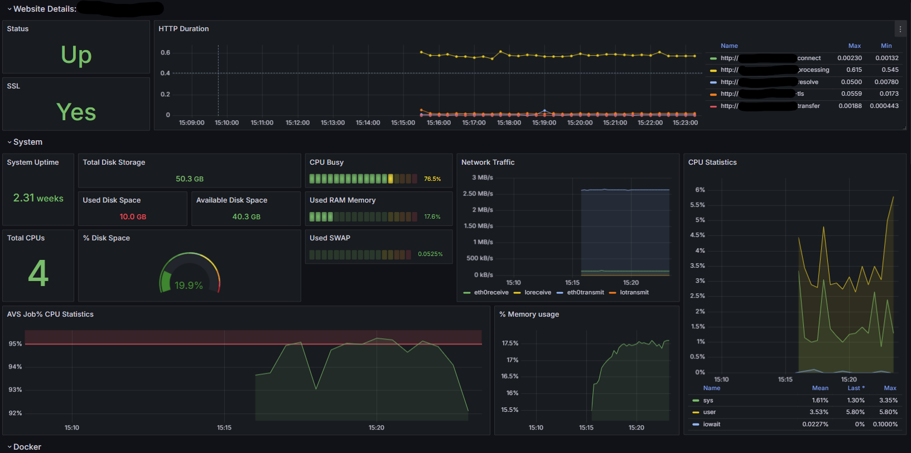
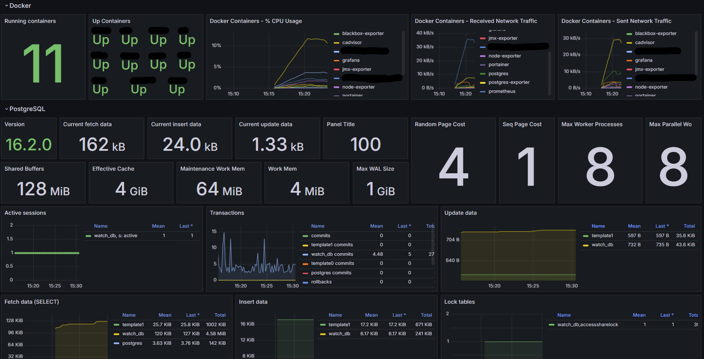

# Monitoring your server with Grafana
## You will find in Grafana -> Dashboard -> Watch, useful informations about:
* **Website** (Status, SSL, Http Duration)
* **System** (System Uptime, RAM, Disk Storage, CPU, Network Trafic, etc.)
* **Docker** (Running Containers, CPU Usage, Recived and Sent Network Trafic)
* **PostgreSQL** (Version, Active Sessions, Transactions, Fetch Data, Insert Data, etc.) 

<br>

 <br>
 <br>

<br>

## To deploy this project, follow this steps: <br>
1. Edit `setup.env` file with your specific cinfiguration <br>

``` -d
nano setup.env
```

2. Copy `setup.env` file to `.env` file <br>
``` -d
cp setup.env .env
```
3. Edit `prometheus/prometheus.yml` file. Just replace `example.com` with your specific configuration <br>
``` -d
nano prometheus/prometheus.yml
```

4. Edit `nginx.conf` file to setup Nginx configuration. Just replace `example.com` with your specific configuration <br>
``` -d
nano nginx/nginx.conf
```

5. Run docker containers <br>
``` -d
docker compose up -d
```

# Done!